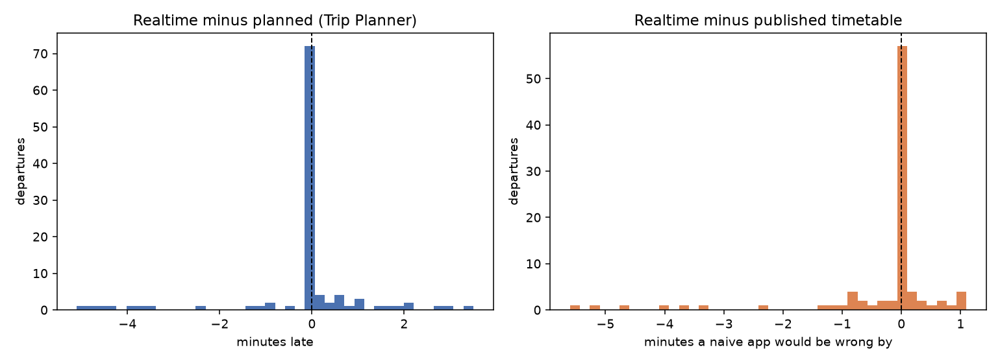
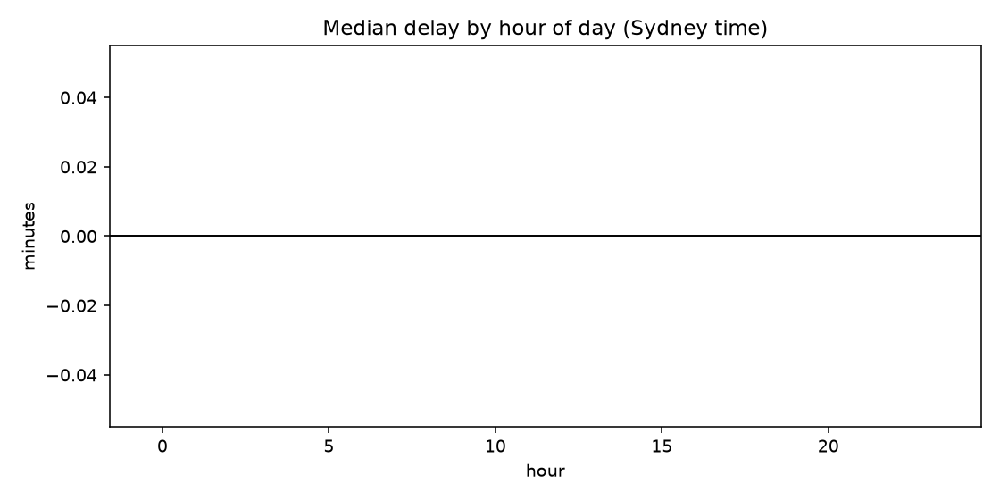

# Phase 0 findings

Does the published timetable alone tell you when your train leaves?

Generated by `nextstop report` from stored samples only. Regenerate any time.

## Collection volume

- Departure samples: **160**
- Distinct departures observed: **157**
- Service alert snapshots: **0**
- Ground-truth observations: **0**

## How late do services actually run?

Realtime coverage: **68%** of departures carried a live estimate.

| Sample | Departures | Median | 90th pct | Late by >2 min |
| --- | ---: | ---: | ---: | ---: |
| All | 107 | 0.0 min | 0.9 min | 5% |
| Off-peak baseline | 107 | 0.0 min | 0.9 min | 5% |

## What a timetable-only app would miss

- Static timetable match rate: **87%** of departures
- Median gap between realtime and published timetable: **0.0 min**
- Departures a timetable-only app would show wrong by more than 2 minutes: **8%**
- Trip Planner's own "planned" time disagreeing with the published timetable by more than 1 min: **0%**

