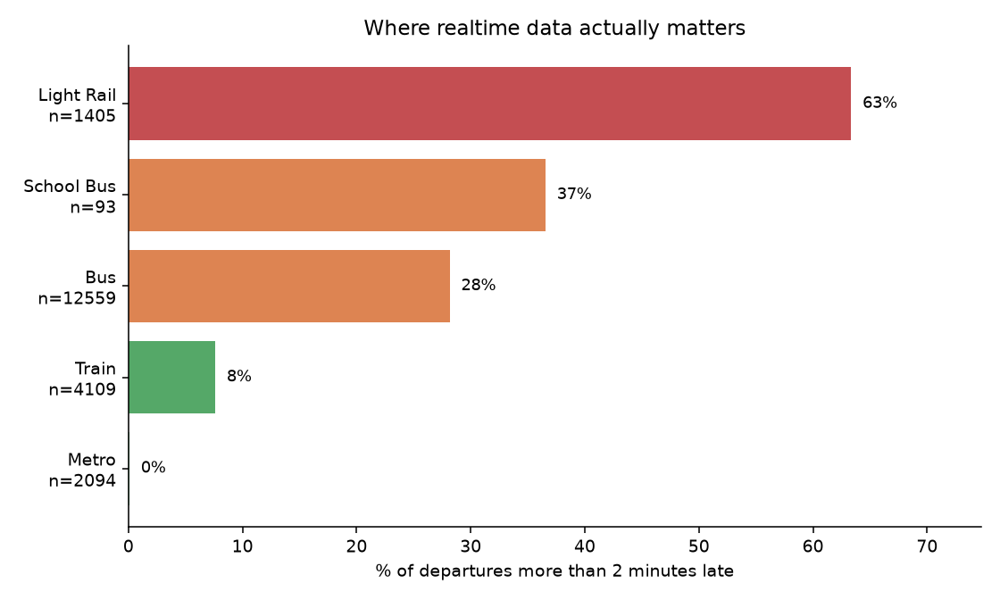

# Phase 0 findings

Does the published timetable alone tell you when your train leaves?

Generated by `nextstop report` from stored samples only. Regenerate any time.

## Collection volume

- Departure samples: **47200**
- Distinct departures observed: **22517**
- Service alert snapshots: **1334**
- Ground-truth observations: **0**

## How late do services actually run?

Realtime coverage: **90%** of departures carried a live estimate.

| Sample | Departures | Median | 90th pct | Late by >2 min |
| --- | ---: | ---: | ---: | ---: |
| All | 20260 | 0.0 min | 4.3 min | 24% |
| Commute window | 10251 | 0.0 min | 4.9 min | 25% |
| Off-peak baseline | 10009 | 0.0 min | 3.8 min | 22% |

### By mode

Aggregated across all modes the median delay is zero, which reads as "the timetable is fine". Split by mode it is not.

| Mode | Departures | Exactly on time | Late by >2 min | Median | 90th pct |
| --- | ---: | ---: | ---: | ---: | ---: |
| Bus | 12559 | 25% | 28% | 0.1 min | 5.2 min |
| Train | 4109 | 79% | 8% | 0.0 min | 1.5 min |
| Metro | 2094 | 64% | 0% | 0.0 min | 0.4 min |
| Light Rail | 1405 | 15% | 63% | 2.5 min | 5.6 min |
| School Bus | 93 | 48% | 37% | 0.0 min | 9.3 min |

## What a timetable-only app would miss

- Static timetable match rate: **91%** of departures
- Median gap between realtime and published timetable: **0.0 min**
- Departures a timetable-only app would show wrong by more than 2 minutes: **26%**
- Trip Planner's own "planned" time disagreeing with the published timetable by more than 1 min: **0%**

_119 departures more than 20 minutes from their planned time are excluded from the histograms above, where they would flatten everything else into a single bar. They remain in every figure in the tables._

